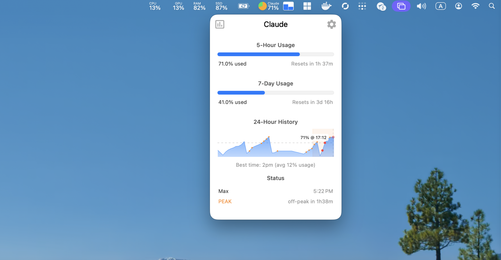

# Claude Module for Stats

Monitor your Claude AI usage directly from the macOS menu bar.

## Features

- **5-Hour Usage** - Track your rolling 5-hour usage limit with real-time countdown
- **7-Day Usage** - Monitor your weekly usage quota
- **24-Hour History Chart** - Visualize usage patterns over time
- **Peak Hours Indicator** - Know when Claude is busiest (8 AM - 2 PM ET weekdays)
- **Best Time Analysis** - Find optimal times to use Claude based on historical data
- **Multiple Widgets** - Mini, Line Chart, Bar Chart, Pie Chart display options

## Screenshots

### Menu Bar Widget

The Claude module displays in your menu bar showing current 5-hour utilization.

### Popup View

Click the menu bar icon to see detailed usage information:
- 5-hour and 7-day usage bars with percentages
- Reset countdowns for each limit
- Model breakdown (Opus/Sonnet usage)
- 24-hour history chart
- Peak hours status
- Best time recommendations

### Settings

Configure authentication and update intervals.

---

## Setup & Login

The Claude module supports two authentication methods. **Claude.ai Web** is the primary method with more frequent updates.

### Method 1: Claude.ai Web (Recommended)

This method uses browser cookies to fetch usage data directly from claude.ai.

#### Step 1: Install Cookie Extractor Extension

Install the "Cookies Extractor" extension for Chrome/Edge:
- [Chrome Web Store](https://chrome.google.com/webstore/detail/cookies-extractor/...)
- Or search "Cookies Extractor" in your browser's extension store

#### Step 2: Get Your Cookies

1. Go to [claude.ai](https://claude.ai) and log in
2. Click the **Cookies Extractor** extension icon in your browser toolbar
3. Click **"Copy as JSON Cookie"**

#### Step 3: Import to Stats

1. Open **Stats** settings (click the Stats icon in menu bar > Settings)
2. Navigate to the **Claude** module
3. Click **"Import from Clipboard"**
4. You should see "Import Successful" confirmation

The status will change from "Not configured" to "OK" with the last fetch time.

#### Update Interval

Choose how often to refresh data:
- 10 seconds (for active monitoring)
- 30 seconds
- 1 minute (default)
- 2 minutes
- 5 minutes

---

### Method 2: Claude Code CLI (Fallback)

If you use the [Claude Code CLI](https://claude.ai/code), you can import tokens from your Keychain.

#### Prerequisites

1. Install Claude Code CLI: `npm install -g @anthropic-ai/claude-code`
2. Log in: `claude login`

#### Import Token

1. Open Stats settings > Claude module
2. In the **"Claude Code (fallback)"** section, click **"Import from Keychain"**
3. Grant Keychain access if prompted

#### Update Interval

- 1 minute
- 2 minutes
- 5 minutes (default)
- 10 minutes

> **Note:** Claude Code method has a longer default interval because API rate limits are more strict.

---

## Understanding the Display

### Usage Bars

| Indicator | Meaning |
|-----------|---------|
| Green (0-50%) | Low usage, plenty of capacity |
| Yellow (50-80%) | Moderate usage |
| Orange (80-95%) | High usage, consider pacing |
| Red (95-100%) | Near limit, may experience throttling |

### Reset Countdowns

- **5-Hour Reset**: Rolling window - resets portion used 5 hours ago
- **7-Day Reset**: Weekly quota - resets portion used 7 days ago

### Peak Hours

Claude experiences higher load during:
- **Peak**: 8 AM - 2 PM ET, Monday-Friday
- **Off-Peak**: All other times

The indicator shows:
- Current status (PEAK/off-peak)
- Time until status changes

### Best Time

Based on your usage history, the module analyzes and recommends hours with lowest average usage.

---

## Widgets

Choose your preferred menu bar display:

| Widget | Description |
|--------|-------------|
| **Mini** | Compact percentage display |
| **Line Chart** | Usage trend over time |
| **Bar Chart** | 5-hour and 7-day comparison |
| **Pie Chart** | Visual usage vs remaining |

Configure widgets in Stats settings > Claude > Widgets.

---

## Troubleshooting

### "Not configured" Status

1. Ensure you're logged into claude.ai in your browser
2. Try re-exporting cookies with "Copy as JSON Cookie"
3. Make sure clipboard contains the JSON before clicking Import

### "Error: Session expired"

Your session token has expired. Re-export cookies from your browser.

### "Error: Rate limited"

Increase the update interval in settings to reduce API calls.

### Claude Code Import Failed

1. Ensure Claude CLI is installed: `which claude`
2. Ensure you're logged in: `claude status`
3. Check Keychain Access has the claude credentials

### Data Not Updating

1. Check the "Last updated" time in the popup
2. Verify internet connection
3. Try clearing and re-importing credentials

---

## Privacy & Security

- Credentials are stored in macOS Keychain (encrypted)
- No data is sent to third parties
- All communication is directly with claude.ai
- Session tokens are masked in the UI (only last 8 characters shown)

---

## Feedback

Report issues or request features at: https://github.com/vanooo/stats/issues
