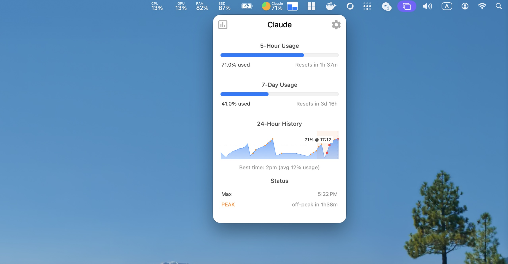

# Claude Module for Stats

Monitor your Claude AI usage directly from the macOS menu bar.

[](Modules/Claude/README.md)

This is a fork of [Stats](https://github.com/exelban/stats) with added Claude AI usage monitoring.

## Installation

### Homebrew

```bash
brew tap solbish/tap
brew install --cask solbish/tap/solbish-stats
xattr -cr /Applications/Stats.app
```

### Manual

Download [Stats.dmg](https://github.com/solbish/stats/releases/latest/download/Stats.dmg), open it, move to Applications, then run:

```bash
xattr -cr /Applications/Stats.app
```

[Full Claude module documentation](Modules/Claude/README.md)

---

## License

[MIT License](https://github.com/solbish/stats/blob/master/LICENSE)
